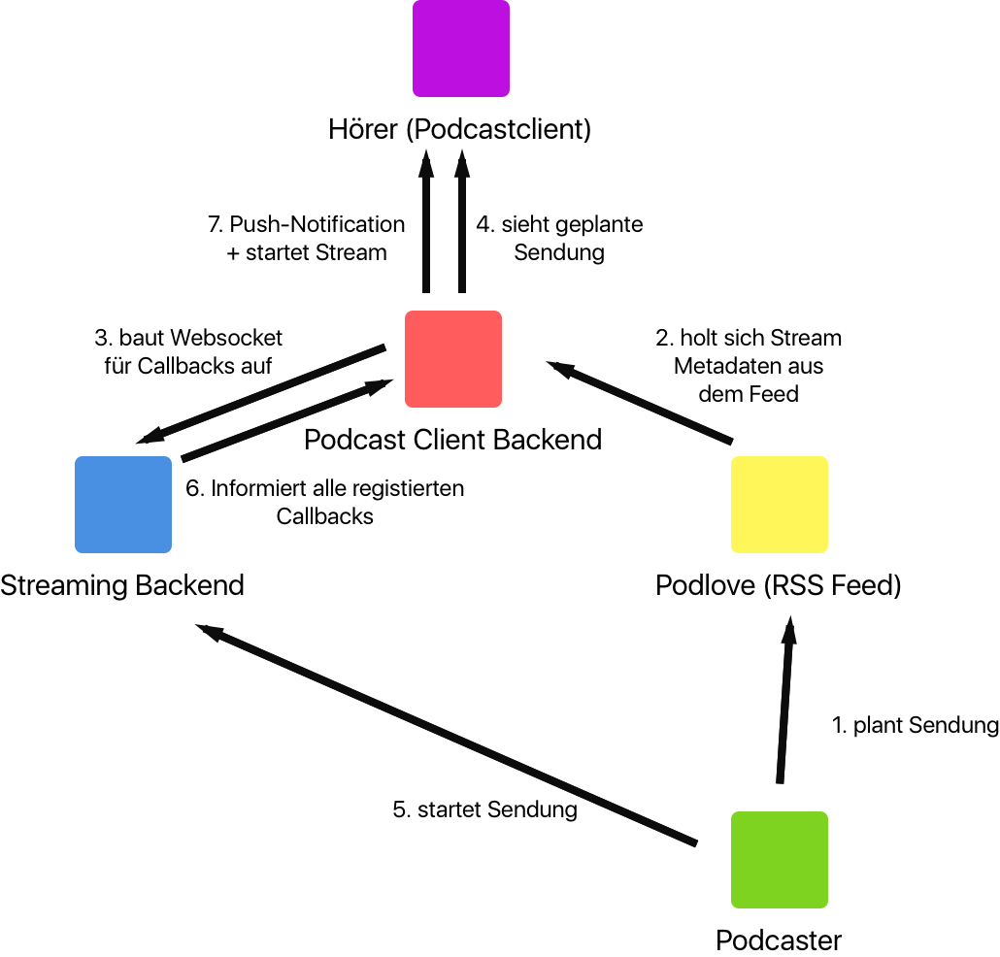

**Das hier ist erst einmal die Beschreibung einer Idee. Weder vollständig noch korrekt.**

[Offene Fragen](https://github.com/funkenstrahlen/podlive-standard/issues)

# Podlive Standard

Ein Standard für offenes Podcast Livestreaming.

Es gibt drei Parteien: Der Podcaster und sein Feed, das Livestreaming Backend und ein Podcastclient Cloudbackend. Podcastclient deshalb, weil Podcast Livestreams in einem Podcastclient perfekt aufgehoben sind und das Cloudbackend ohnehin schon Feeds verarbeitet.

## Die Grundidee
Informationen zur Livesendung wandern in den Podcastfeed.

Grundlegende Metadaten zum Streaming werden in den `channel` gepackt:

* Link auf eine Webseite mit Infos. Das kann dann sein: Chat, iCal, ...

Geplante Episoden als eigenes `item`, aber **ohne Enclosure**. So werden sie von Podcastclients ignoriert.

* Wann wird (voraussichtlich) gesendet?
* Wo gibt es den Livestream? (mehrere URLs möglich)
* Webhook URL für Callbacks (optional)
* Sendungstitel
* Sendungsbeschreibung
* Collaborators (optional) (wobei das eigentlich ein anderer Standard sein sollte unabhängig vom Livestreaming)
* Wie lange wird die Sendung dauern? (optional)
* Coverart (optional)

Diese Infos kann dann ein Podcast Backend parsen, das ohnehin schon Feeds ausliest.

Die Callbacks sind vor allem für Push-Notifications interessant und um zu wissen, ob eine Sendung wirklich läuft. Die Callback URL zeigt dann zum Beispiel auf ein Streaming Backend, das diese standardisierte Schnittstelle anbietet. Jedes Backend, das sich für Echtzeit Informationen zu einer Sendung interessiert kann sich zu diesem Webhook verbinden und darüber Infos direkt vom Streaming Backend erhalten.

Anfragen, die man über den Weghook Callback abwickeln könnte:

* Läuft der Stream?
* Läuft die Sendung?
* Aktuelle Hörerzahlen
* Sende Notification (zum Beispiel *Sendung beginnt in 10min*)



## RSS Live Streaming Extension

Namespace definieren: `xmlns:pse="http://podlove.org/live-streaming"`

```xml
<channel>
	<title>Funkenstrahlen</title>
	<itunes:subtitle>Die Nachlese aus dem Apple Special Event</itunes:subtitle>
	<link>http://podcast.funkenstrahlen.de</link>
	<description>Technik, Internet, Gesellschaft.</description>
	<lastBuildDate>Fri, 13 May 2016 11:22:17 +0000</lastBuildDate>
	<image><url>http://podcast.funkenstrahlen.de/wp-content/cache/podlove/b8/384e4a23bd372ef6ef74855365d14e/funkenstrahlen_original.png</url><title>Funkenstrahlen</title><link>http://podcast.funkenstrahlen.de</link></image>
	<pse:live-streaming info-url="URL"/>
	...
	<item>
	    <title>FS002 - Arduino Blinkenlichter</title>
	    <link>http://podcast.funkenstrahlen.de/2013/02/27/fs002-arduino-blinkenlichter/</link>
	    <pubDate>Wed, 27 Feb 2013 08:46:18 +0000</pubDate>
	    <pse:time start="2015-03-28T12:34+1" end="2015-03-28T17:34+1">
	    <guid isPermaLink="false">podlove-2015-05-17t15:21:00+00:00-9a6539d4d72f6e7</guid>
	    <description>Die zweite Folge und schon eine Sonderfolge. Ich erzähle von meinem Arduino Projekt, an dem ich die letzten Tage gebastelt habe. Dabei versuche ich zu erklären wie man die LED-Leuchtleisten von IKEA an den Arduino anschließen kann, welche Bauteile man dafür braucht und wie ich es geschafft habe, dass man die Farbe der LEDs dann mit dem iPhone steuern kann. Durch die simple API bieten sich nun unendlich viele Möglichkeiten.</description>
	    <atom:link rel="http://podlove.org/deep-link" href="http://podcast.funkenstrahlen.de/2013/02/27/fs002-arduino-blinkenlichter/#" />
	    <itunes:image href="http://podcast.funkenstrahlen.de/wp-content/cache/podlove/fe/cf0a7a7dfb680f8da110c73274b623/fs002-arduino-blinkenlichter_original.png" />
		<pse:webhook-registration>URL</pse:webhook-registration>
		<pse:streams media="audio" title="Standard Audio" lang="de">
			<pse:stream type="icecast" title="Deutsch MP3" mime-type="audio/mpeg" bitrate="128000" url="http://streams.xenim.de/metaebene.mp3" />
			<pse:stream type="icecast" title="Deutsch OGG" mime-type="audio/ogg" bitrate="128000" url="http://streams.xenim.de/metaebene.ogg" />
			<pse:stream type="icecast" title="Deutsch OPUS" mime-type="audio/opus" bitrate="128000" url="http://streams.xenim.de/metaebene.opus" />
			<pse:stream type="icecast" title="Deutsch ADTS" mime-type="audio/aac-adts" bitrate="128000" url="http://streams.xenim.de/metaebene.aac" />
			<pse:stream type="icecast" title="Deutsch AACP" mime-type="audio/aac-aacp" bitrate="128000" url="http://streams.xenim.de/metaebene.heaac" />
		</pse:streams>
		<pse:streams media="audio" title="Standard Audio with Live Translation" lang="en,gsw">
			<pse:stream type="icecast" title="English MP3" mime-type="audio/mpeg" bitrate="128000" url="http://streams.xenim.de/metaebene-translation.mp3" />
			<pse:stream type="icecast" title="English OGG" mime-type="audio/ogg" bitrate="128000" url="http://streams.xenim.de/metaebene-translation.ogg" />
			<pse:stream type="icecast" title="English OPUS" mime-type="audio/opus" bitrate="128000" url="http://streams.xenim.de/metaebene-translation.opus" />
			<pse:stream type="icecast" title="English ADTS" mime-type="audio/aac-adts" bitrate="128000" url="http://streams.xenim.de/metaebene-translation.aac" />
			<pse:stream type="icecast" title="English AACP" mime-type="audio/aac-aacp" bitrate="128000" url="http://streams.xenim.de/metaebene-translation.heaac" />
		</pse:streams>
		<pse:streams media="video" title="Standard Audio with Live Translation" lang="de">
			<pse:stream type="icecast" title="Deutsch MPEG" mime-type="vnd.apple.mpegURL" bitrate="128000" url="http://freakshow.fm/stream/hls" />
		</pse:streams>
	</item>
</channel>
```

## Webhook Callback API des Streaming Backends

Zwei Dinge sind zu definieren:

* Wie registriere ich mich für ein Callback?
* Welche Callbacks gibt es?

Inspiration: [Github Webhooks](https://developer.github.com/v3/repos/hooks/), [Pubsubhubbub](http://pubsubhubbub.github.io/PubSubHubbub/pubsubhubbub-core-0.4.html)